# mini-aoz-sim

[](https://github.com/USERNAME/mini-aoz-sim/actions/workflows/tests.yml)

**Agent-based simulation of multi-brand autonomous haulage at a shared mine intersection.**
How should autonomous trucks from *different suppliers* (and manually driven vehicles) share an
intersection inside an Autonomous Operation Zone (AOZ)? This model compares three coordination
architectures and measures their effect on productivity, waiting times, fairness between suppliers
and safety margins, including what happens when the coordinator fails.

Built in Python with [Mesa 3](https://mesa.readthedocs.io). Fully reproducible (seeded, common
random numbers), verified against an analytical result, 40 automated tests, 1,900 simulation runs.

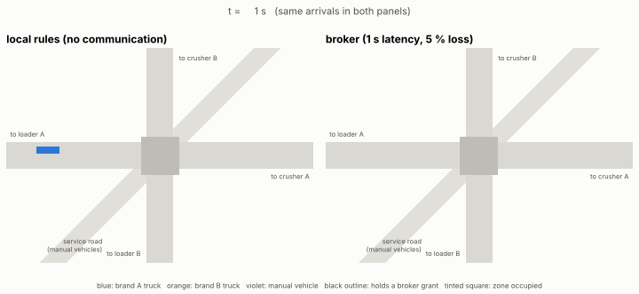

*Same arrivals in both panels. Left: no communication, every truck stops at the line and looks.
Right: a supplier-neutral broker grants access leases (black outline), so most trucks flow through.*

---

## Key findings

| # | Finding | Evidence |
|---|---|---|
| 1 | **Without communication, every crossing costs about 15 s.** Local "stop, look, first-come" rules add 15.6 s per crossing vs 1.9 s (central) and 2.3 s (broker). Trucks restarting from standstill also occupy the zone 1.7x longer per crossing. | E1 |
| 2 | **Coordination quality changes how many trucks the loaders need.** With 2 trucks per brand, local rules lose 8 % of throughput (36.3 vs 39.7 loads/h); with 3, loader utilisation is 90 % instead of 95 %. Beyond that the loaders are the bottleneck and the cost moves into truck idle time. | E1 |
| 3 | **A broker is only worth it if the link is good enough.** Broker delay grows with latency and crosses the no-communication baseline at about 7 s one-way latency. Message loss matters much less (30 % loss adds 0.5 to 0.6 s up to 3 s latency) because grants and reports are re-sent every cycle. | E2 |
| 4 | **Unconnected vehicles are the real interoperability gap.** The broker cannot see manual vehicles, so conflicts with them are caught by the trucks' own safety layer (about 0.13 interventions per manual crossing). The central controller sees them and has none, but its trucks pay in delay (1.5 s to 5.1 s). | E3 |
| 5 | **Tuning beats hardware.** The most influential parameter is the broker's grant look-ahead (30 s instead of 10 s: +9.2 s per crossing). 3 s latency adds 2.1 s; 20 % message loss only 0.2 s. | E4 |
| 6 | **Priority rules move waiting time between suppliers.** "Brand A first" leaves total delay unchanged but creates a 1.3 s per crossing gap against brand B (vs 0.3 s with FIFO). "Loaded first" does not reduce delay here and worsens the 95th percentile. | E5 |
| 7 | **The fallback behaviour decides what an outage costs.** A 10-min broker failure with a fail-safe stop loses 9.1 loads (the whole production of the outage). Falling back to local rules loses none: delay rises to the local level, then recovers within a few minutes. No safety violation and no severe intervention in either case. | E6 |
| 8 | **At a shared crusher, unfairness is invisible until it saturates.** Below 85 % utilisation the priority rule changes nothing. At 99 %, "brand A first" makes brand B wait 112 s vs 28 s for brand A (FIFO: 79 s for both), while total tonnage stays the same. Supplier-neutral rules must be checked with per-brand KPIs. | E7 |
| 9 | **The safety invariant held in every run.** 1,900 campaign runs and 29 stress or failure tests: never two vehicles in the zone. | tests, CSVs |

> These are results of a simplified model with assumed parameters (see [Assumptions](#assumptions)
> and [Limitations](#limitations)). They show *mechanisms and orders of magnitude*, not predictions
> for a specific mine.

---

## Research questions

| Question | Experiment |
|---|---|
| How are productivity, waiting times and flow affected by different collaboration strategies between autonomous and manual vehicles? | E1, E3 |
| Which parameters are most important for robust and safe traffic management in an AOZ? | E4 |
| How sensitive is coordination to communication delays, information quality and prioritisation rules? | E2, E5 |
| What fallback behaviour should apply when the coordination layer fails? | E6 |
| How do shared loading/unloading points and queues behave with several suppliers? | E7 |
| How can interoperability, intentions and shared situational awareness be modelled in an agent-based simulation? | Model design: intention messages, leases, heartbeat, perception layer |
| How does broker/mediator coordination compare with centralised or local coordination? | E1 to E3 |

---

## The model

### Layout

```
   Loader A ====== A_haul ======>  [ZONE]  ======>  Crusher A  ┐
   Loader A <===== A_return <=====  [ZONE]  <======  Crusher A  │ optional: one crusher
                                      ||                         │ shared by both brands
   Loader B ====== B_haul ======>  [ZONE]  ======>  Crusher B  │ (E7)
   Loader B <===== B_return <=====  [ZONE]  <======  Crusher B  ┘
                                      ||
                      service road (manual light vehicles)
```

Two roads, one per truck brand, cross a service road used by manually driven light vehicles.
The crossing is a single **exclusive conflict zone**: at most one vehicle inside at any time.
Each truck cycles *queue, load, haul (loaded), queue, dump, return (empty)* and crosses the zone twice per cycle.

### Agents

| Agent | Behaviour |
|---|---|
| `HaulTruck` (brands A and B) | 1-D longitudinal kinematics (acceleration, comfortable and emergency braking), car-following with a standstill gap, state machine across loader and crusher, coordination client + independent safety layer |
| `ManualVehicle` | Follows the site rule: stops at the line, looks (3 s), goes if the zone is free and no truck is moving within 30 m. Never connected to any coordinator |
| Loaders and crushers | Single servers with variable service times (normal, CV 15 %); FIFO queue, or brand priority at a shared crusher |

The speed update guarantees that a vehicle can always stop before its next constraint
(`v*dt + v^2/2b <= d`, a Gipps-type rule), so collisions with the vehicle ahead are impossible by construction.

### Coordination strategies

All strategies answer one question for each truck: *may I enter the zone now?* They differ only in **what information they use**.

| Strategy | Information | Rule |
|---|---|---|
| `local` | On-board perception only | Stop at the line, wait 2 s, go if the zone is free and nobody waiting has priority |
| `central` | Full real-time state of every vehicle, manual ones included, no latency | Single site controller grants exclusive access leases by priority, then estimated time of arrival (ETA). Idealised single-supplier benchmark |
| `broker` | Only the limited **intention messages** each brand publishes (`leg id, distance to line, speed, status, brand`), through a channel with latency and loss. Manual vehicles are invisible | Same lease logic as central, applied to stale information |

**Site priority policy** (`priority_rule`), shared by every strategy and by the shared crusher queue:
`fifo` (first come, first served), `loaded_first` (loaded trucks and manned vehicles first) or
`brand_priority` (one supplier first, as a supplier-specific system might do).

**Lease protocol.** A grant is valid until an absolute expiry time. A truck only uses it if it can
clear the zone before expiry (conservative bound from standstill). The broker issues a new grant only
after the holder reports *cleared* or the lease has expired, and never while any vehicle reports being
in the zone. Two grants therefore never overlap in time, even if messages are lost. Grants and status
reports are re-sent every cycle, so a lost message only delays.

**Heartbeat and fallback.** The broker broadcasts a heartbeat every cycle. If trucks hear nothing for
5 s, or the broker says it is recovering, they switch to the configured fallback: `local` rules or a
fail-safe `stop`. A lease already granted stays valid. After a crash the broker restarts with no state
and stays passive for one lease duration (40 s), because leases granted before the crash may still be in use.

**Independent safety layer.** Every truck keeps a perception check that overrides the coordinator:
if the zone is occupied, or another vehicle is physically committed to entering it (too close to stop),
the truck brakes for the line. Each override is counted as an **intervention**, and as **severe** if the
required deceleration exceeds the truck's emergency braking capability. Interventions measure how often
the coordination layer was wrong; the safety layer is what keeps the invariant.

### Metrics

| Metric | Definition |
|---|---|
| Intersection delay | Actual time from 120 m upstream until the rear clears the zone, minus free-flow time (also per brand) |
| Throughput | Loads dumped per hour (total and per brand) |
| Loader / crusher utilisation | Share of the measured period the server is busy |
| Crusher wait | Time between arriving at the crusher queue and starting to dump, per brand |
| Cycle time | Time between two departures of the same truck from its loader |
| Interventions per hour | Safety-layer overrides (severe ones counted separately) |
| Fallback share | Share of time trucks were not coordinated by a live broker |
| Safety violations | Steps with more than one vehicle in the zone (must be 0) |

Each run: 15 min warm-up (discarded) + 2 h measured. Each configuration: 20 seeds. Plots show the mean and 95 % confidence interval.

---

## Assumptions

| Parameter | Value | Note |
|---|---|---|
| Time step | 1 s | 1 Hz control cycle; convergence checked down to 0.1 s |
| Haul road length | 500 m per leg | Intersection in the middle |
| Conflict zone | 20 m, exclusive | Conservative: no parallel crossing of compatible movements |
| Truck | 12 m, 18 km/h loaded, 36 km/h empty, a = 0.5 m/s², b = 1.0 m/s², emergency 2.5 m/s² | |
| Light vehicle | 5 m, 43 km/h, a = 1.5 m/s², b = 2.5 m/s² | |
| Load / dump time | 120 s / 60 s, CV 15 % | One loader per brand; one crusher per brand, or one shared (E7) |
| Broker baseline link | 1 s one-way latency, 5 % loss | Swept in E2 |
| Grant look-ahead / lease / heartbeat timeout | 10 s / 40 s / 5 s | |
| Manual traffic | 6 crossings/h (Poisson) | Swept in E3 |

All values live in [`aozsim/config.py`](aozsim/config.py). They are plausible orders of magnitude, not data from a specific site.

---

## Verification and validation

| Check | Result |
|---|---|
| **Analytical validation.** One truck, no conflicts: the simulated cycle must equal *load + dump + two free-flow legs* (accelerate, cruise, brake) = **352.5 s** | 356.0 s at dt = 1 s (+1.0 %), 352.2 s at dt = 0.1 s (-0.1 %). First-order discretisation error, converges |
| **Kinematics.** 10,000 random states: a vehicle can always stop before its constraint | Pass |
| **Safety invariant.** Never two vehicles in the zone: 3 strategies x 3 stress scenarios x 3 seeds, 2 outage scenarios, and all 1,900 campaign runs | 0 violations |
| **Liveness.** No deadlock under stress (throughput > 0) | Pass |
| **Consistency.** Broker with zero latency and loss and no manual traffic must reproduce the central controller exactly | Identical |
| **Policy.** Brand priority shifts waiting to the other brand at a saturated shared crusher; FIFO does not | Pass |
| **Failure.** Outage: fallback share equals outage + recovery + timeout; a fail-safe stop costs production, a local fallback does not | Pass |
| **Reproducibility.** Same seed gives the same result; strategies see identical manual traffic (common random numbers) | Pass |

```bash
pytest -q        # 40 passed
```

Tests run automatically on every push (GitHub Actions, Python 3.12 and 3.13).

---

## Results

### E1. Fleet size: how many trucks do the loaders need?

<p>
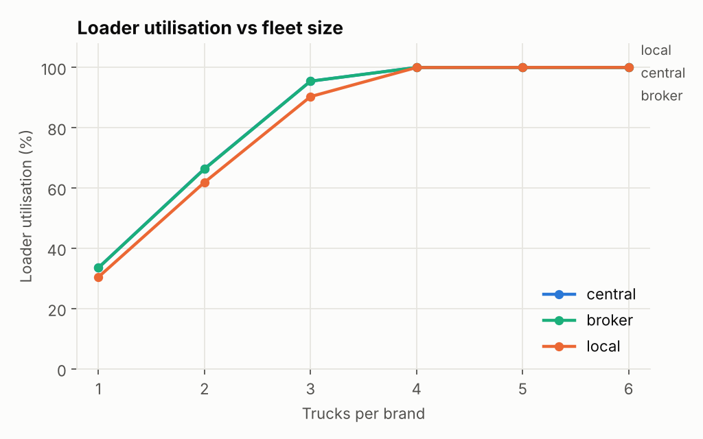
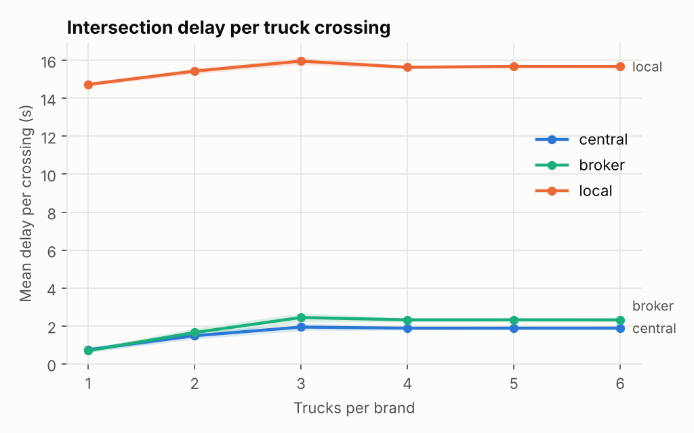
</p>

The coordinated strategies reach 95 % loader utilisation with 3 trucks per brand; local rules reach 90 %.
With 4+ trucks the loaders saturate and all strategies deliver the same tonnage, but under local
rules each truck spends about 14 s more per crossing waiting: idle equipment, fuel and tyre wear.

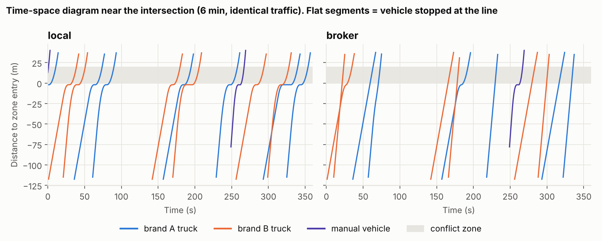

### E2. Broker vs communication quality

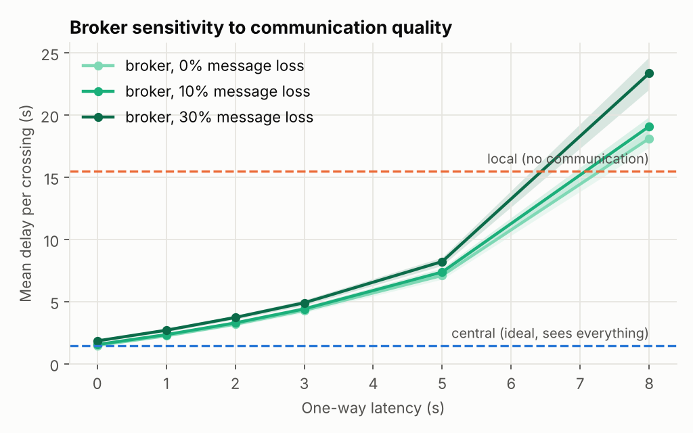

With a good link the broker is close to the omniscient central controller (2.3 s vs 1.5 s at 1 s latency).
Delay rises faster than linearly with latency: grants must arrive before a truck starts braking for the line,
and every hand-over of the zone costs a full round trip. Around 7 s one-way latency the broker becomes worse
than not communicating at all, and the 95th percentile delay reaches 45 s at 8 s latency.

### E3. Manual vehicles

<p>
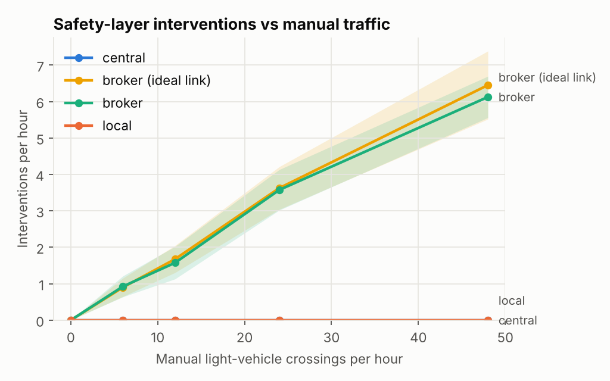
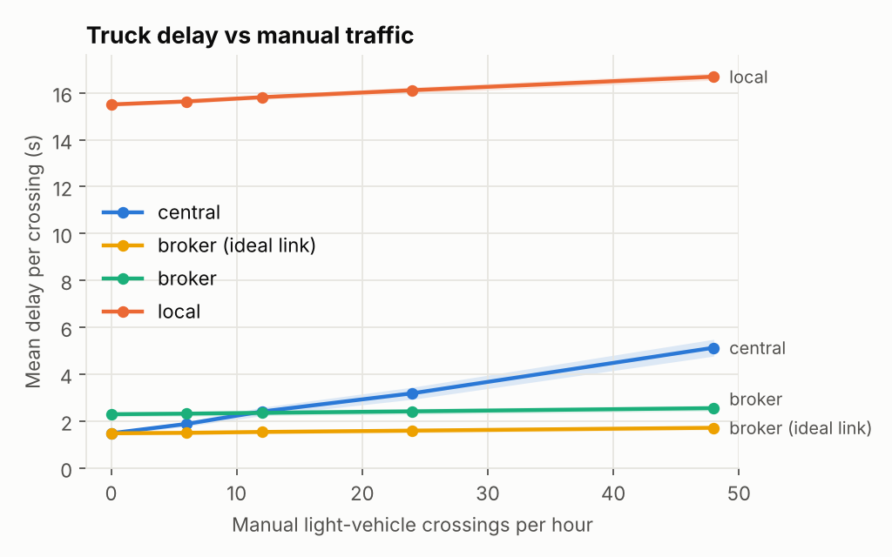
</p>

The broker only knows connected vehicles. Every manual crossing is a potential disagreement that the
trucks' own perception must resolve: interventions grow linearly with manual traffic. None was severe,
because drivers do not start when a truck is close. The central controller avoids interventions by
holding trucks for manual vehicles, which costs truck delay. **What the broker gains in truck flow is
partly borrowed from the safety layer.** Connecting manual vehicles (a tag or tablet that publishes
intentions) is the obvious next requirement.

### E4. What matters most?

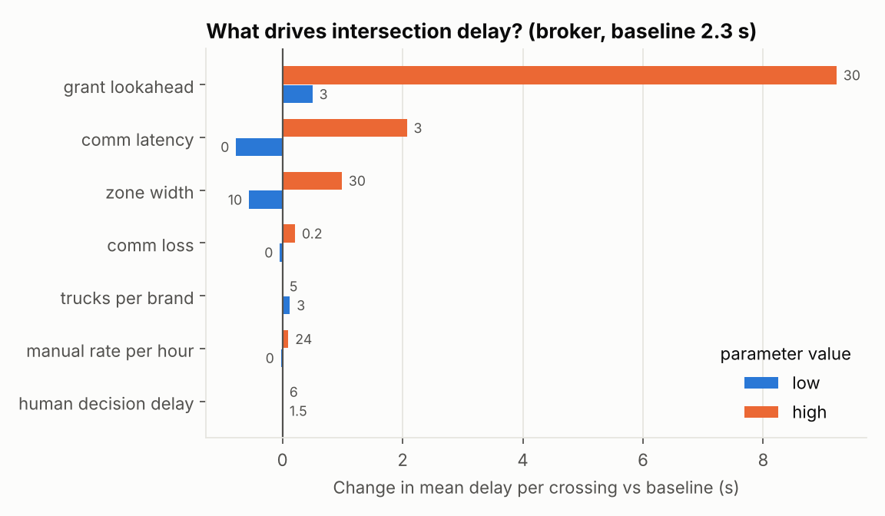

One-at-a-time sensitivity around the broker baseline. Configuration (grant look-ahead) and latency
dominate; message loss and the human decision time barely affect truck delay. The human decision time
has *no* effect on broker trucks, which is itself a symptom of finding 4.

### E5. Priority rules: who pays?

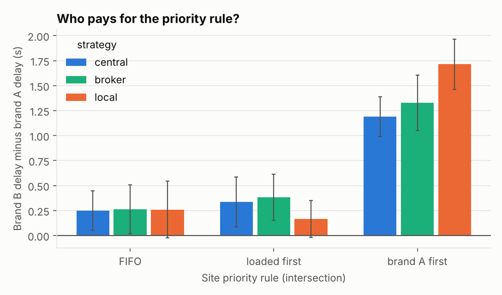

| Strategy | Rule | Mean delay (s) | Brand A (s) | Brand B (s) | p95 (s) |
|---|---|---|---|---|---|
| broker | FIFO | 2.32 | 2.19 | 2.45 | 13.9 |
| broker | loaded first | 2.44 | 2.25 | 2.63 | 15.0 |
| broker | brand A first | 2.31 | 1.65 | 2.98 | 13.9 |
| local | brand A first | 15.80 | 14.95 | 16.67 | 25.2 |

A priority rule hardly changes the total; it decides *who* waits. In a multi-supplier mine, this is a
contractual question as much as a technical one.

### E6. Broker outage and fallback

<p>
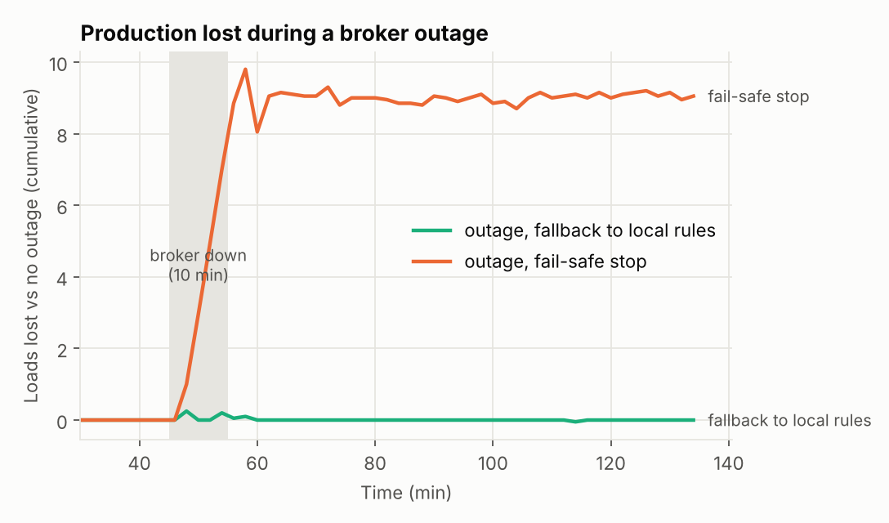
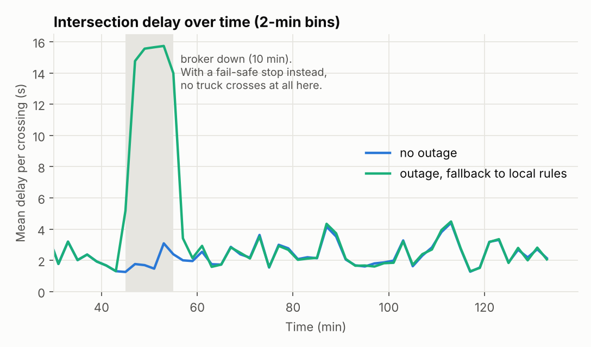
</p>

The broker crashes 30 min into the measured period, for 10 min. With a **fail-safe stop**, trucks that
do not already hold a lease wait at the line: 9.1 ± 0.8 loads are lost, and trucks that waited through the
outage show delays close to 10 min. With a **fallback to local rules**, production is unaffected: the
intersection simply runs at the local-rules level (about 15 s per crossing) until the broker has
restarted and finished its 40 s recovery. The transitions (lease holders still crossing, broker restart)
produced no safety violation and no severe intervention.

### E7. A crusher shared by both brands

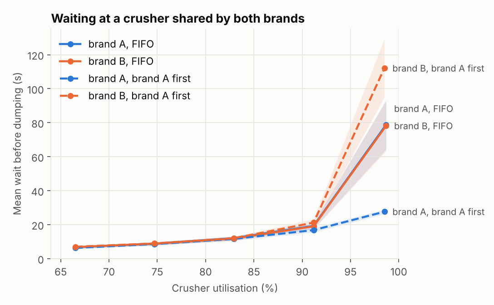

Waiting grows sharply as the shared crusher approaches saturation, as queueing theory predicts. With
FIFO both brands share the burden equally. With "brand A first" the burden moves almost entirely to
brand B, and the total tonnage does not show it (59.0 vs 59.1 loads/h at 99 %).

---

## Limitations

- **One intersection, exclusive zone.** Real AOZs have networks of intersections, one-lane segments and passing bays.
- **1-D kinematics.** No vehicle dynamics, grades, payload-dependent braking, or articulation.
- **Simplified perception.** Perfect detection inside its range; no false positives or negatives.
- **Simplified communication.** Constant latency, independent losses, synchronised clocks, one broadcast heartbeat for all trucks.
- **Same rule for every brand.** Heterogeneous local rules between suppliers are not modelled yet.
- **Parameters are assumptions**, not calibrated on site data.

## Next steps

1. Several intersections and a loading area shared by both brands.
2. Heterogeneous supplier rules and partial intention sharing (what is the *minimum* information a broker needs?).
3. Manual vehicles that publish intentions (tablet or tag) to quantify the value of connecting them.
4. Burst losses and variable latency (Gilbert-Elliott model); partial outages affecting one brand only.
5. Calibration against site data; comparison with SUMO for the traffic layer.

---

## Run it

Requires Python 3.12+.

```bash
python -m venv .venv && source .venv/bin/activate      # Windows: .venv\Scripts\activate
pip install -r requirements.txt

python -m aozsim --strategy broker --trucks 4 --latency 2 --manual 12   # one run, prints metrics
pytest -q                                                                # 40 tests
python experiments/run_experiments.py          # full campaign (E1 to E7), about 6 min on 2 cores
python experiments/plot_results.py             # figures in results/figures/
python experiments/animate.py                  # animation.gif
```

## Project structure

```
aozsim/
  config.py         all parameters, with units
  geometry.py       lanes and conflict zone
  kinematics.py     safe-speed update, analytical free-flow time
  vehicles.py       HaulTruck, ManualVehicle (Mesa agents)
  policy.py         site priority rules
  coordination.py   LocalPriority, TokenCoordinator (central, broker), heartbeat and fallback
  communication.py  lossy channel, status reports, grants, heartbeats
  intersection.py   occupancy and safety invariant
  model.py          MineModel (Mesa model), loaders and crushers, metrics
experiments/        campaign runner, plots, animation
results/            CSV outputs and figures
tests/              verification and validation tests
.github/workflows/  continuous integration
```

## Authors

- **Abderrahmane BOULAMI**, final-year engineering student, Arts et Métiers ParisTech
- **Kawtar BELLAMINE**, final-year engineering student, Arts et Métiers ParisTech

MIT licence.
